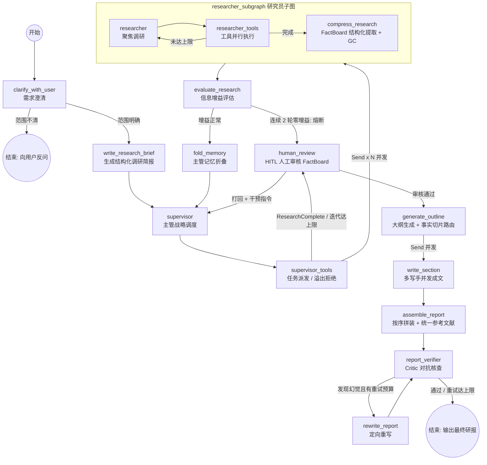

# 🔬 Open Deep Research · 工业级魔改版

> 本项目基于 [langchain-ai/open_deep_research](https://github.com/langchain-ai/open_deep_research) 深度改造，在保留原有 Supervisor–Researcher 多智能体骨架的基础上，围绕**证据链可信、推理成本可控、成文质量可核查**三个目标重写了核心链路，并新增了 Streamlit 流式前端与人在回路（HITL）干预能力。

## ✨ 相比原版的核心魔改点

| # | 魔改方向 | 说明 |
|---|---------|------|
| 1 | **FactBoard 结构化事实看板** | 用原子化的 `Fact(entity, claim, source)` 三元组取代原版的自由文本笔记，压缩阶段强制以 `json_mode` 结构化输出，并内置基于 claim 的去重归约器，从源头抑制幻觉与上下文污染 |
| 2 | **信息增益动态剪枝与熔断** | 新增 `evaluate_research` 节点：每轮并发检索后统计**全新事实数**，连续 1 轮零增益则向 Supervisor 注入系统警告，连续 2 轮零增益则强制熔断、提早进入成文阶段，大幅节省 Token 开销 |
| 3 | **Supervisor 记忆折叠** | 新增 `fold_memory` 节点：当主管消息数超过 10 条时，调用压缩模型将中间历史折叠为一条"长期记忆胶囊"（保留初始设定与最近一次决策现场），防止长调研任务上下文爆炸 |
| 4 | **Critic 对抗核查 + 定向重写闭环** | 新增 `report_verifier` / `rewrite_report` 节点：核查模型逐句比对报告断言与 FactBoard，输出引用准确度评分与幻觉清单；发现幻觉则打回定向重写，最多循环 `max_verification_retries`（默认 2）次 |
| 5 | **Map-Reduce 分层成文** | 原版单节点写报告改为三段式：`generate_outline`（全局大纲 + 按 Fact ID 切片分发，含遗漏事实兜底拦截）→ `write_section`（多写手节点并发成文）→ `assemble_report`（按大纲顺序拼装 + 生成全局统一参考文献） |
| 6 | **人在回路（HITL）干预** | 新增 `human_review` 节点：检索阶段结束后通过 `interrupt` 挂起流程，用户审核 FactBoard 后可直接放行，或填写干预指令打回 Supervisor 继续调研（同时重置熔断计数器） |
| 7 | **技能注册表（Skills）** | Supervisor 派发任务时可按需分配专业技能，研究员子图动态挂载：`quantitative_analysis`（PythonREPL 量化沙箱）、`long_doc_mining`（长文 BM25 子 RAG）、`data_visualization`（Chart.js + QuickChart 图表生成），详见下文技能表 |
| 8 | **动态工具路由与状态隔离** | `ConductResearch` 新增 `required_tools` / `required_skills` 字段，每个研究员只挂载被分配的武器（`think_tool` 恒定保留）；Supervisor 内部决策消息与外层用户对话严格隔离，超过并发上限的任务被显式拒绝而非静默丢弃 |
| 9 | **公网检索架构解耦** | `web_search`（Tavily）改为**批量查询、仅返回摘要片段**；全文获取剥离到 `fetch_webpage`（基于 Jina Reader `r.jina.ai`，约 15000 字符安全截断）；超长文档交由 `long_doc_mining` 技能做全文 BM25 召回，不再受截断限制 |
| 10 | **上下文瘦身与主动 GC** | 彻底移除 `raw_notes` 冗余状态；研究员压缩完成后立即下发 `RemoveMessage` 销毁子图内的原始消息，防止 Checkpointer 状态膨胀 |
| 11 | **模型配置体系重构** | 角色模型由 `summarization/research/compression/final_report` 四件套改为 **`supervisor / research / compression / final_report / verifier` 五角色**，全部经环境变量注入；代码自动为模型名拼接 `openai:` 前缀，配合 `OPENAI_BASE_URL` 可无缝接入任意 OpenAI 兼容网关（本仓库默认对接阿里云百炼 DashScope，运行 Kimi / DeepSeek / Qwen 等模型） |
| 12 | **多供应商 Token 超限检测** | 超限识别新增 Qwen/DashScope 错误特征，与 OpenAI / Anthropic / Gemini 并列；压缩阶段超限时自动截断历史并重试 |
| 13 | **Streamlit 流式前端** | 新增 `api/frontend.py`：三通道流式渲染（values / messages / updates）、节点级状态机提示、HITL 审核表单、`<think>` 思考内容过滤、打字机降频刷新、最近 5 条会话历史管理 |
| 14 | **MCP 纯 SSE 微服务化（预留）** | `load_mcp_tools` 重写为基于 `MultiServerMCPClient` 的 SSE 长连接单例（工业 RAG `:8080` / ERP 数据库 `:8001`），当前在 `get_all_tools` 中默认注释关闭，需要私有数据源时取消注释即可启用 |

> 原版 `src/legacy/`（Plan-and-Execute 工作流与旧版多智能体实现）已在本仓库中移除。

## 🗺️ 运行架构



## 🚀 快速启动

### 1. 环境准备

要求 Python ≥ 3.10（`langgraph.json` 固定使用 3.11）：

```bash
git clone <your-repo-url>
cd open_deep_research
uv venv --python 3.11
source .venv/bin/activate  # Windows: .venv\Scripts\activate
uv sync
```

魔改新增的运行时依赖（已包含在 `pyproject.toml`，`uv sync` 会自动安装）：

- `langchain-experimental`：提供 `PythonREPL`，支撑量化分析沙箱技能
- `rank-bm25`：提供 BM25 检索，支撑长文挖掘技能

若需要使用 Streamlit 前端，需额外安装（未纳入主依赖）：

```bash
uv pip install streamlit
# langgraph-sdk 已随 langgraph-cli[inmem] 一并安装
```

### 2. 配置环境变量

复制模板后按下表补全（⚠️ 注意：仓库内 `.env.example` 为原版模板，**完整清单以本节为准**）：

```bash
cp .env.example .env
```

| 环境变量 | 来源 | 说明 |
|---------|------|------|
| `OPENAI_API_KEY` | 原版 | 主 API Key。由于所有模型名会被自动加上 `openai:` 前缀，此处应填写**兼容网关**的 Key（默认为 DashScope Key） |
| `OPENAI_BASE_URL` / `OPENAI_API_BASE` | 🆕 魔改新增 | OpenAI 兼容网关地址，例如 `https://dashscope.aliyuncs.com/compatible-mode/v1` |
| `SUPERVISOR_MODEL` | 🆕 魔改新增 | 主管模型（澄清、简报、调度），如 `kimi-k2.5` |
| `RESEARCH_MODEL` | 原版 | 研究员模型（检索与工具调用），如 `deepseek-v4-pro` |
| `COMPRESSION_MODEL` | 原版 | 压缩模型（FactBoard 提取、记忆折叠、技能内部推理），如 `deepseek-v3.1` |
| `WRITER_MODEL` | 原版 | 成文模型（大纲、章节撰写、重写），如 `kimi-k2.6` |
| `VERIFIER_MODEL` | 🆕 魔改新增 | 核查模型（Critic 引用核验），如 `qwen-plus-character` |
| `TAVILY_API_KEY` | 原版 | 默认搜索源 Tavily 的 Key |
| `JINA_API_KEY` | 🆕 魔改新增（可选） | `fetch_webpage` 与 `long_doc_mining` 走 Jina Reader，不配也可匿名访问，配置后更稳定 |
| `DASHSCOPE_API_KEY` | 🆕 魔改新增（预留） | 当 `GET_API_KEYS_FROM_CONFIG=true` 或模型名以 `qwen` 开头且未加前缀时用于鉴权映射 |
| `ANTHROPIC_API_KEY` / `GOOGLE_API_KEY` | 原版 | 使用对应原生搜索或模型时需要 |
| `LANGSMITH_TRACING` / `LANGSMITH_API_KEY` / `LANGSMITH_ENDPOINT` / `LANGSMITH_PROJECT` | 原版（可选） | LangSmith 链路追踪 |
| `SUPABASE_KEY` / `SUPABASE_URL` / `GET_API_KEYS_FROM_CONFIG` | 原版 | 仅 Open Agent Platform 生产部署需要，本地开发保持 `false` |

> 模型名只需填写裸名称（如 `kimi-k2.5`），`Configuration.from_runnable_config` 会自动拼接 `openai:` 前缀并经 `OPENAI_BASE_URL` 路由。`.env` 由 `configuration.py` 以 `override=True` 加载，会覆盖同名 Shell 环境变量。

### 3. 启动后端（LangGraph Server）

```bash
langgraph dev --allow-blocking
# 或使用免安装方式：
uvx --refresh --from "langgraph-cli[inmem]" --with-editable . --python 3.11 langgraph dev --allow-blocking
```

启动后可用入口：

```
- 🚀 API: http://127.0.0.1:2024
- 🎨 Studio UI: https://smith.langchain.com/studio/?baseUrl=http://127.0.0.1:2024
- 📚 API Docs: http://127.0.0.1:2024/docs
```

### 4. 启动前端（🆕 Streamlit 魔改新增）

```bash
streamlit run api/frontend.py
```

前端默认连接 `http://localhost:2024` 上的 `Deep Researcher` 图，并以固定开发 Token（`local-dev-token-123`，已在 `src/security/auth.py` 中放行，**仅限本地联调**）完成鉴权。如需修改地址或 Token，编辑 `api/frontend.py` 顶部常量即可。

### 5. 使用流程

1. 在输入框提交调研需求；若开启了 `allow_clarification`（默认开启），范围不清时智能体会先反问澄清。
2. 主管并发派发研究员，前端状态面板实时展示"调度 → 检索 → 压缩 → 大纲 → 并发成文"各阶段。
3. **检索阶段结束后流程必定在 `human_review` 挂起**：页面会展开 FactBoard 事实清单，你可以
   - 点击「✅ 事实无误，直接生成报告」放行；或
   - 填写干预指令后点击「🔄 打回节点，继续调研」，指令会作为 `[HUMAN INTERVENTION]` 消息注入 Supervisor 并重置熔断计数。
4. 报告经 Critic 核查（未通过自动重写）后，最终 Markdown 研报渲染在对话区，文末附全局统一参考文献。

通过 SDK/API 恢复挂起流程时，`command` 载荷为 `{"resume": {"action": "continue"}}` 或 `{"resume": {"action": "feedback", "feedback": "..."}}`（也兼容纯字符串输入）。

## ⚙️ 配置详解

所有配置项定义在 [configuration.py](src/open_deep_research/configuration.py)，可经环境变量、LangGraph Studio「Manage Assistants」或 `configurable` 运行时下发。

### 模型角色（🆕 五角色体系）

| 角色字段                      | 环境变量 | 默认 max_tokens | 承担节点             |
|---------------------------|---------|----------------|------------------|
| `supervisor_model`        | `SUPERVISOR_MODEL` | 8192 | 需求澄清、简报生成、主管调度   |
| `research_model`          | `RESEARCH_MODEL` | 10000 | 研究员检索与工具调用       |
| `compression_model`       | `COMPRESSION_MODEL` | 8192 | FactBoard 提取、记忆折叠 |
| `writer_model`            | `WRITER_MODEL` | 8192 | 大纲生成、章节撰写、报告重写   |
| `verifier_model`          | `VERIFIER_MODEL` | 4000 | Critic 对抗核查      |
| `logical_reasoning_model` | `LOGICAL_REASONING_MODEL` | 10000 | Critic 对抗核查、各技能内部推理    |


> 原版 `summarization_model` 已移除（评测脚本已同步更新）。所选模型需支持工具调用；结构化输出统一走 `json_mode`，对不支持原生 structured output 的兼容网关模型更友好。

### 调研行为参数

| 参数 | 默认值 | 说明 |
|------|-------|------|
| `allow_clarification` | `True` | 允许在调研开始前向用户反问澄清 |
| `max_concurrent_research_units` | `3` | 单轮最大并发研究员数，溢出任务收到显式错误回执 |
| `max_researcher_iterations` | `6` | 主管派发轮数安全锁，达到上限强制结束调研 |
| `max_react_tool_calls` | `10` | 单个研究员的工具调用轮数上限 |
| `max_structured_output_retries` | `3` | 结构化输出解析失败的重试次数 |
| `max_verification_retries` | `2` 🆕 | 「核查 → 重写」闭环的最大循环次数 |
| `search_api` | `tavily` | 可选 `tavily` / `openai`（原生搜索）/ `anthropic`（原生搜索）/ `none` |
| `mcp_config` / `mcp_prompt` | `None` | MCP 服务器配置与附加提示（当前 SSE 接入为预留能力，默认关闭） |

### 工具与技能分配

Supervisor 通过 `ConductResearch` 的 `required_tools` / `required_skills` 字段为每个研究员精准挂载能力：

**基础工具（`required_tools` 可选项）**

| 工具名 | 说明 |
|-------|------|
| `web_search` | Tavily 批量检索，支持多 query 并发与去重，**仅返回标题/URL/摘要片段** |
| `fetch_webpage` | Jina Reader 提取网页全文为 Markdown，约 15000 字符安全截断 |
| `search_equipment_knowledge` | 私有 RAG 知识库检索（MCP SSE `:8080`，预留，默认关闭） |
| `query_erp_database` | 结构化 ERP 数据库查询（MCP SSE `:8001`，预留，默认关闭） |
| `think_tool` | 战略反思工具，恒定挂载，不可剥离 |

**专业技能（`required_skills` 可选项，注册于 `utils.AVAILABLE_SKILLS`）**

| 技能名 | 实现机制 | 适用场景 |
|-------|---------|---------|
| `quantitative_analysis` | 压缩模型生成 Python 代码 → `PythonREPL` 沙箱执行 → 结果校验 → 出错自愈重试（最多 5 轮） | 财报比率、统计指标等需要精确计算的场景 |
| `long_doc_mining` | Jina Reader 无截断全文 → 2500/300 滑窗切片 → 本地 BM25 召回 Top-5（零 Token 成本）→ 小模型精准提纯 | 年报、招股书、长篇论文等超出 `fetch_webpage` 截断限制的文档 |
| `data_visualization` | 小模型输出 Chart.js JSON 配置 → QuickChart API 生成短链图片 | 营收对比、市占率、时间线等图表需求 |

图表链接具备全链路防丢失保护：压缩阶段以最高优先级将 Markdown 图片物理提取为独立 Fact，章节撰写与报告重写阶段若检测到图表被模型遗漏，会强制回插正文。

## 📊 评测

评测脚本位于 `tests/`，对接 [Deep Research Bench](https://huggingface.co/spaces/Ayanami0730/DeepResearch-Leaderboard)（100 个博士级调研任务，RACE 评分）。魔改后已同步移除脚本中的 `summarization_model` 相关配置。

```bash
# 在 LangSmith 数据集上运行完整评测
python tests/run_evaluate.py

# 导出评测结果为可提交的 JSONL
python tests/extract_langsmith_data.py --project-name "YOUR_EXPERIMENT_NAME" --model-name "your-model-name" --dataset-name "deep_research_bench"
```

> 警告：跑完全部 100 个样例的成本约为 $20–$100（取决于模型选择）。原版的评测结果与排行榜记录请参阅[上游仓库](https://github.com/langchain-ai/open_deep_research)。

## 📁 项目结构

```
open_deep_research/
├── api/
│   └── frontend.py            # 🆕 Streamlit 流式前端（三通道流式渲染 + HITL 审核 UI）
├── src/
│   ├── open_deep_research/
│   │   ├── deep_researcher.py # LangGraph 主图：主工作流 + 主管子图 + 研究员子图
│   │   ├── configuration.py   # 五角色模型与调研行为配置
│   │   ├── state.py           # 状态定义与结构化输出模型（Fact / FactBoard / VerificationReport / ReportOutline 等）
│   │   ├── prompts.py         # 全量提示词模板（含记忆折叠、大纲生成、核查、重写等新增模板）
│   │   └── utils.py           # 搜索工具、技能注册表、MCP SSE 客户端、Token 超限检测
│   └── security/
│       └── auth.py            # LangGraph 部署鉴权（含本地开发 Token 放行）
├── tests/                     # Deep Research Bench 评测脚本
├── examples/                  # 示例研报（arXiv / PubMed / 推理市场分析）
├── langgraph.json             # LangGraph 图入口配置（Deep Researcher）
└── pyproject.toml             # 依赖与构建配置
```

## 📄 License

MIT，与上游保持一致。
